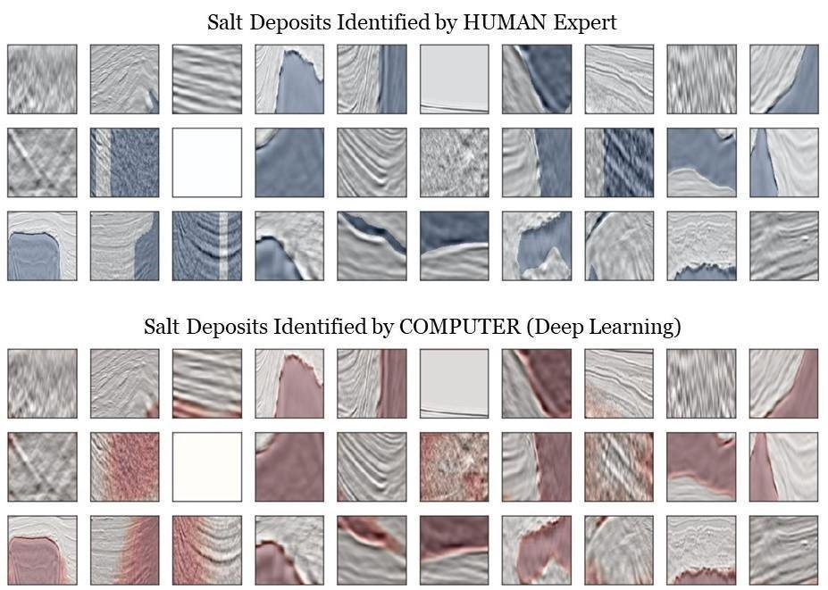

# Salt Body Identification Using Deep Learning
> Using a Deep Convolutional Neural Network (U-Net)
> for Identifying Salt Bodies in Seismic Data 
> A Kaggle Competition 

Salt bodies are important geological features in exploration seismology. Many oil and gas traps are around this type of rock. Also, the presence of salt body makes many issues for the seismic imaging. Therefore, identifying these geological features in seismic images is important. However, it takes too much time and effort for a human expert to pick these features on a seismic volume. This code attempts to do this task automatically using a deep learning approach. 

Specifically, we use a U-Net (encoder and decoder deep neural networks) to input a raw post-stack seismic image and output a masking file (salt body is masked in this case). 

The problem and dataset for this problem is provided by TGS through a Kaggle competition [link to TGS Salt Identification Challenge](http://google.com)(https://www.kaggle.com/c/tgs-salt-identification-challenge). 

The code first read training and test datasets. Then it makes images ready for a training session. Keras is used to build the U-Net. Finally, we test our Keras model on the test set. Finally a submission file (csv format) is built.

## Running the Code

Please run this code using Jupyter Notebook.
